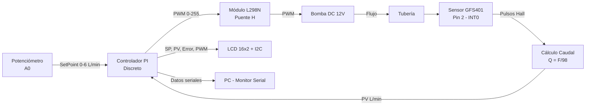

# Diagrama de Bloques del Sistema



## Señales del sistema

| Señal | Tipo | Rango | Descripción |
|---|---|---|---|
| SP | Analógica (ADC) | 0.0 – 6.0 L/min | Caudal deseado vía potenciómetro |
| PV | Digital (pulsos) | 0.0 – 6.0 L/min | Caudal real medido por GFS401 |
| Error | Calculada | –6.0 – 6.0 | SP − PV |
| PWM | Salida | 0 – 255 | Señal de control a la bomba |

## Flujo de control

```
Cada 100 ms (Ts):
  1. Leer ADC(A0) → SP (0–6 L/min)
  2. Leer contador pulsos → PV (L/min)
  3. Si |SP - SP_anterior| > 0.05 → reset integral
  4. Calcular error = SP − PV
  5. PI: pi_out = Kp·error + Ki·Ts·Σ(error)   [en L/min, límites 0–6]
  6. Escalar: PWM = (pi_out / SP_MAX) × 255
  7. analogWrite(Pin 9, PWM)
  8. Actualizar LCD (ciclo 3 mensajes, 10 s)
```

## Lazo de control

```
SP ──(+)── e(t) ──[Kp]──(+)──[Saturación 0–SP_MAX]──[Escalar ×42.5]── PWM ──[Planta]── PV
       ▲                  │                                                        │
       │                  │                                                        │
       └──────────────────┴────────────────────────────────────────────────────────┘
                         [-]
                     Integrador Ki·Ts·Σ(e)
```

> El PI opera internamente en L/min (0–6). La salida se escala a PWM (0–255) con factor `255/6 ≈ 42.5` antes de enviarse a la bomba.
